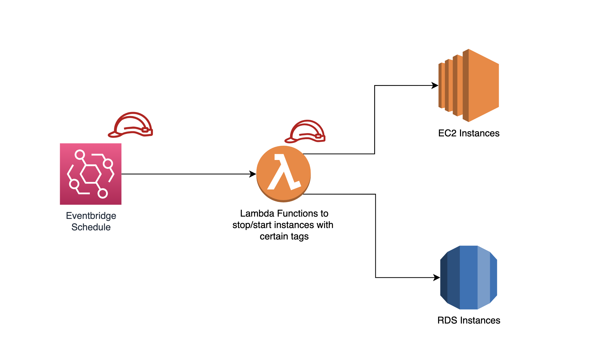

<!-- markdownlint-disable -->

# Terraform module to easily schedule EC2 and RDS instances stop/start [](https://github.com/cloudposse/terraform-aws-eks-cluster/releases/latest)

<!-- markdownlint-restore -->


## This module will help you reduce expenses by shutting down ec2 and rds instances when they are not needed and turning them on schedule.

<br/>

# How does it work?

## This module will deploy the following resources:

- IAM Roles for Eventbridge to invoke Lambda Functions
- IAM Roles for Lambda Functions to start/stop EC2 and RDS instances
- Eventbridge schedules
- Four Lambda Functions (two for EC2 instances and two for RDS instances)



## Eventbridge schedules will trigger the Lambdas to start/stop the instances based on a schedule defined by ourself.

<br/>

# How to use it

### 1. Clone the repository or set the source directly against this github reposiroty in your Terraform code.

   <br/>

Example:

```
module "ec2-rds-scheduler" {
  source                   = "../../modules/ec2-rds-scheduler"
  ec2_start_stop_schedules = var.ec2_start_stop_schedules
  rds_start_stop_schedules = var.rds_start_stop_schedules
}
```

or

```
module "ec2-rds-scheduler" {
  source = "github.com/eanselmi/ec2-rds-scheduler?ref=1.0.0"
  ec2_start_stop_schedules = var.ec2_start_stop_schedules
  rds_start_stop_schedules = var.rds_start_stop_schedules
}
```

Note: You can specify the module version here if you don't want to use the latest version. In this example, we use the 1.0.0 version.

<br/>

### 2. Create in your code the following variables or modify directly the variables in the module if you don't want to add variables in your code.

```
variable "ec2_start_stop_schedules" {
  description = "Schedules and tags to turn off and turn on ec2 instances"
  type        = map(map(string))
  default     = {}
}


variable "rds_start_stop_schedules" {
  description = "Schedules and tags to turn off and turn on RDS instances"
  type        = map(map(string))
  default     = {}
}
```

<br/>

### 3. Using tfvars or defaults in the previous variable declaration or directly in the module if you skipped step 2, you can declare the schedule for turning off and on ec2 and rds instances. In this example, we are scheduling ec2 instances in the dev environment to turn off at 1:49 am UTC and turn them on at 4:45 am UTC. All ec2 instances with tag env:dev will be affected. For the production environment, we will turn ec2 instances off at 5:10 am and turn them on at 8:44 am (only instances with tag env:prod will be affected by this schedule). Finally, the RDS instances with tag env:dev will be turned off at 3:50 UTC and turned on at 9:45 am. You can add as many schedules as you need.

<br/>

```
ec2_start_stop_schedules = {
  "schedule_dev" = {
    "cron_stop"  = "cron(49 01 ? * * *)"
    "cron_start" = "cron(45 04 ? * * *)"
    "tag_key"    = "env"
    "tag_value"  = "dev"
  }
  "schedule_prod" = {
    "cron_stop"  = "cron(10 5 ? * * *)"
    "cron_start" = "cron(44 8 ? * * *)"
    "tag_key"    = "env"
    "tag_value"  = "prod"
  }

}

rds_start_stop_schedules = {
  "rds_schedule_dev" = {
    "cron_stop"  = "cron(50 3 ? * * *)"
    "cron_start" = "cron(45 9 ? * * *)"
    "tag_key"    = "env"
    "tag_value"  = "dev"
  }
}

```

## IMPORTANT: the time must be set in UTC.

<br/>

### 4. Apply and enjoy.

---

<br/>

### Any ideas, corrections, or feedback are most welcome!

<br/>

# [If this Terraform module was helpful for you, please let me know. You can find me on LinkedIn.](https://www.linkedin.com/in/nazareno-anselmi/)
